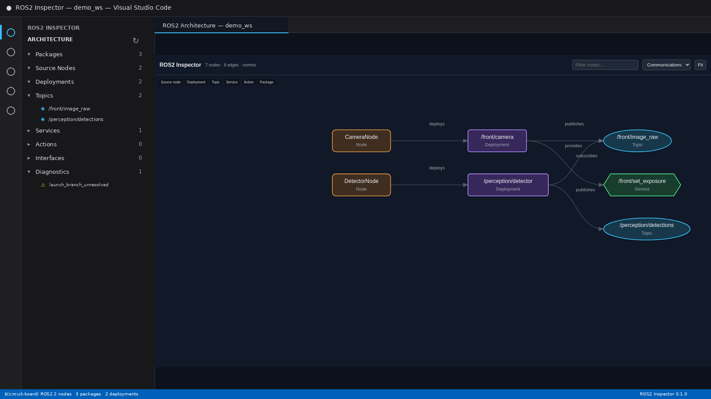
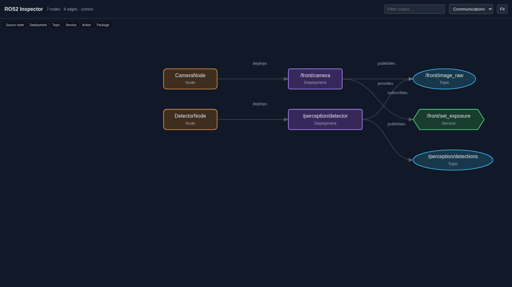
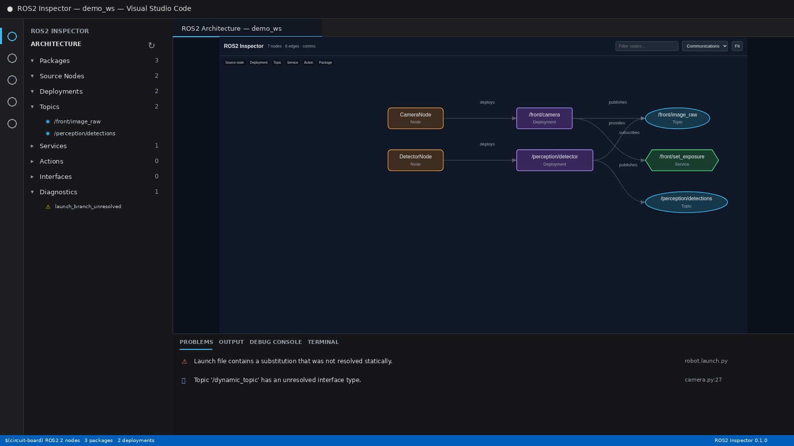

# ROS2 Inspector for VS Code

Bring the **ROS2 Inspector** static ROS 2 architecture model directly into Visual Studio Code: packages, source nodes, launch deployments, topics, services, actions, interfaces, diagnostics, policy checks, and an interactive architecture graph.



## Highlights

- Native Activity Bar **Architecture Explorer**
- First-class source-node and launch-deployment representation
- Communications, dependencies, and full-architecture graph modes
- Searchable, CSP-restricted, dependency-free graph webview
- VS Code **Problems** integration for source-located analyzer findings
- Policy validation from `ros2inspector_policy.yaml`
- One-click navigation back to source
- Workspace Trust aware: no analyzer process runs in an untrusted workspace
- No telemetry and no runtime network requests
- Runs the CLI with `shell: false` to avoid shell interpolation
- Supports local VS Code on Linux/macOS/Windows and remote extension hosts such as WSL/SSH/Dev Containers when `ros2inspector` is installed in the extension-host environment

## Requirements

Install ROS2 Inspector **0.1.3 or later** in the environment where VS Code's extension host runs:

```bash
python -m pip install -U "ros2inspector>=0.1.3"
ros2inspector --version
```

For a local desktop workspace this is normally your local Python environment. For Remote SSH, WSL, Dev Containers, or Codespaces, install it in that remote environment.

## Install from source

```bash
git clone https://github.com/aminebensaid66/ros2_inspector_vscode.git
cd ros2_inspector_vscode
npm run verify
npm run package
```

Then install the generated `ros2-inspector-vscode-0.1.0.vsix` with **Extensions → … → Install from VSIX…**.

No `npm install` is required: the extension intentionally has zero runtime and development npm dependencies.

## Use

1. Open a ROS 2 workspace containing `package.xml` files.
2. Open the **ROS2 Inspector** Activity Bar view.
3. Run **ROS2 Inspector: Refresh Workspace**.
4. Expand Packages, Source Nodes, Deployments, Topics, Services, Actions, Interfaces, or Diagnostics.
5. Run **ROS2 Inspector: Open Architecture Graph** for a visual model.
6. Add a `ros2inspector_policy.yaml` and run **ROS2 Inspector: Validate Policy** for architecture policy checks.

### Graph



The webview is fully self-contained. It does not load CDNs or remote JavaScript.

### Diagnostics



## Configuration

| Setting | Default | Purpose |
|---|---|---|
| `ros2Inspector.executablePath` | `ros2inspector` | Analyzer command/path |
| `ros2Inspector.workspacePath` | empty | Explicit ROS workspace root |
| `ros2Inspector.minimumVersion` | `0.1.3` | Minimum supported CLI |
| `ros2Inspector.refreshOnSave` | `true` | Re-analyze relevant source on save |
| `ros2Inspector.policyFile` | `ros2inspector_policy.yaml` | Policy file |
| `ros2Inspector.graph.maxNodes` | `350` | Graph rendering safety bound |

## Architecture

```text
VS Code extension host
        │
        │ spawn(shell=false)
        ▼
 ros2inspector >= 0.1.3
        │
        │ graph full --format json
        ▼
 Unified Architecture Model
   ├─ Explorer
   ├─ Graph webview
   ├─ Problems diagnostics
   └─ Source navigation
```

The extension deliberately treats ROS2 Inspector as the source of truth instead of reimplementing ROS parsing in JavaScript.

## Development

```bash
npm test
npm run verify
npm run package
```

Open this repository in VS Code and press **F5** to launch an Extension Development Host for manual UI testing.

See [docs/TESTING.md](docs/TESTING.md), [docs/ARCHITECTURE.md](docs/ARCHITECTURE.md), and [docs/RELEASE.md](docs/RELEASE.md).

## Security and privacy

ROS2 Inspector for VS Code does not send source code or workspace metadata anywhere. See [SECURITY.md](SECURITY.md).

## License

MIT
