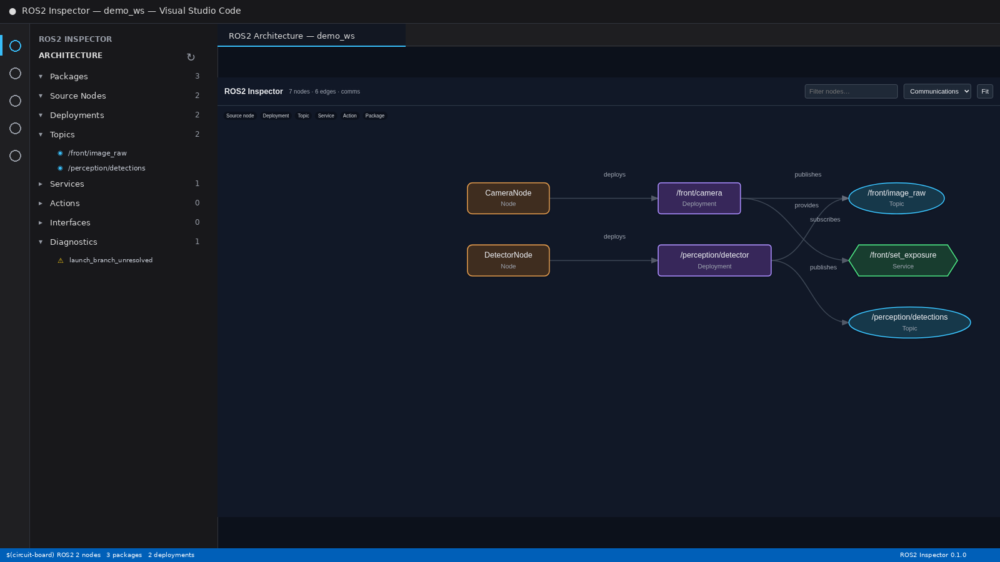
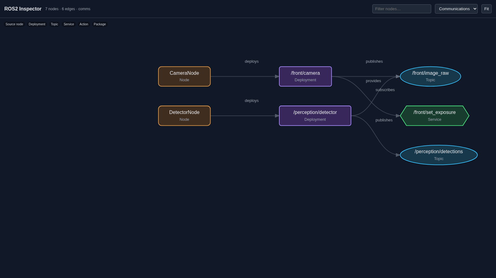

# ROS2 Inspector for VS Code

Turn the released **ROS2 Inspector** static model into an architecture investigation workspace inside Visual Studio Code.



## What 0.2.0 adds

- Relationship-aware, expandable explorer instead of flat inventories.
- Source nodes aggregate their launch deployments, publishers/subscribers, services, actions, interfaces, and findings.
- Topics show publishers/subscribers; services show providers/clients; actions show servers/clients; deployments link back to their source nodes.
- Packages expose metadata/health, dependencies, source nodes, deployments, interfaces, and analyzer findings.
- First-class **Audit Findings** and **Policy Violations**, grouped by severity and rule type.
- Entity Details panel with static metadata, source evidence, incoming/outgoing graph relationships, related entities, findings, source/reveal/copy actions.
- VS Code Problems integration for source-located static diagnostics/audit/policy results.
- Architecture graph with real zoom, wheel/trackpad zoom, drag pan, fit/reset, arrowheads, edge labels, search, kind/package/namespace/relationship filters, isolated-entity control, selection details, and 1/2-hop focus.
- Reliable cancellable refresh generations so older analyzer results cannot overwrite newer ones; failed refreshes are visibly stale.
- Analyzer timeout and output-size bounds.

## Static-only by design

This extension **does not inspect a running ROS graph**. It does not call `ros2 node`, `ros2 topic`, `ros2 service`, or `ros2 action`; connect to DDS/RMW/rosbridge; invoke launch files; source or build a workspace; monitor messages; or execute workspace code.

A ROS 2 installation is **not required**. The extension only runs the static `ros2inspector` CLI. Suggested ROS CLI commands can be copied as plain text; they are never executed by the extension.

## Requirements

Install ROS2 Inspector **0.1.3 or later** in the environment where the VS Code extension host runs:

```bash
python -m pip install -U "ros2inspector>=0.1.3"
ros2inspector --version
```

For Remote SSH, WSL, Dev Containers, or Codespaces, install it in that remote extension-host environment.

## Install from source

```bash
git clone https://github.com/aminebensaid66/ros2_inspector_vscode.git
cd ros2_inspector_vscode
npm run verify
npm run package
```

Install `ros2-inspector-vscode-0.2.0.vsix` with **Extensions → … → Install from VSIX…**.

No `npm install` is required: the extension has zero npm runtime dependencies and uses Node/VS Code built-ins.

## Use

1. Open a workspace containing ROS `package.xml` files.
2. Open the **ROS2 Inspector** Activity Bar view.
3. Run **ROS2 Inspector: Refresh Workspace**.
4. Expand entities to investigate relationships and findings.
5. Use **Show Details**, **Reveal in Architecture Graph**, and **Open Source** to move between code and architecture.
6. Run **ROS2 Inspector: Run Architecture Audit** for built-in connectivity/health findings.
7. Run **ROS2 Inspector: Create Starter Policy** or point `ros2Inspector.policyFile` at a policy, then use **Validate Policy**.

## Graph



The graph is a CSP-restricted, dependency-free webview with no CDN or runtime network access.

## Configuration

| Setting | Default | Purpose |
|---|---:|---|
| `ros2Inspector.executablePath` | `ros2inspector` | Analyzer command/path in extension host |
| `ros2Inspector.workspacePath` | empty | Optional explicit static workspace root |
| `ros2Inspector.minimumVersion` | `0.1.3` | Minimum supported CLI |
| `ros2Inspector.refreshOnSave` | `true` | Re-analyze relevant files inside selected workspace |
| `ros2Inspector.policyFile` | `ros2inspector_policy.yaml` | Policy path |
| `ros2Inspector.analyzer.timeoutMs` | `120000` | Per-process timeout |
| `ros2Inspector.analyzer.maxOutputMB` | `20` | Per-process stdout/stderr capture bound |
| `ros2Inspector.graph.maxNodes` | `350` | Rendering safety bound (clamped 25–2000) |

## Privacy and security

- No telemetry.
- No source code or workspace metadata is sent over the network.
- No runtime network requests or remote webview assets.
- No analyzer subprocess is started in an untrusted workspace.
- All analyzer subprocesses use `shell: false`.
- Webviews use restrictive CSPs and safe DOM rendering.

The Python analyzer remains the source of truth for ROS parsing and architecture semantics. See [docs/ANALYZER_CONTRACT.md](docs/ANALYZER_CONTRACT.md), [docs/ARCHITECTURE.md](docs/ARCHITECTURE.md), [docs/TESTING.md](docs/TESTING.md), and [SECURITY.md](SECURITY.md).

## License

MIT
